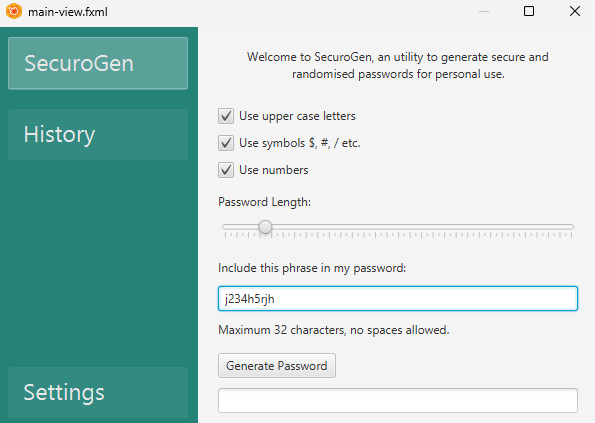

# SecuroGen
SecuroGen is a desktop application developed in Java / JavaFX, designed for generating cryptographically secure passwords.

  

## Features

- **Customizability:** choose from upper case, symbols, numbers, length, etc.
- **History:** see history of generated passwords, from a database, alongside time it was generated
- **Settings:** clear the database and sort by newest/oldest generated

## How it functions / libraries

- **JavaFX:** used for building the gui components 
- **SQLite JBDC Driver:** used for establishing a connection with the SQLite db

## License

The MIT License lets you do almost anything you want with this project, even making and distributing closed source versions.

